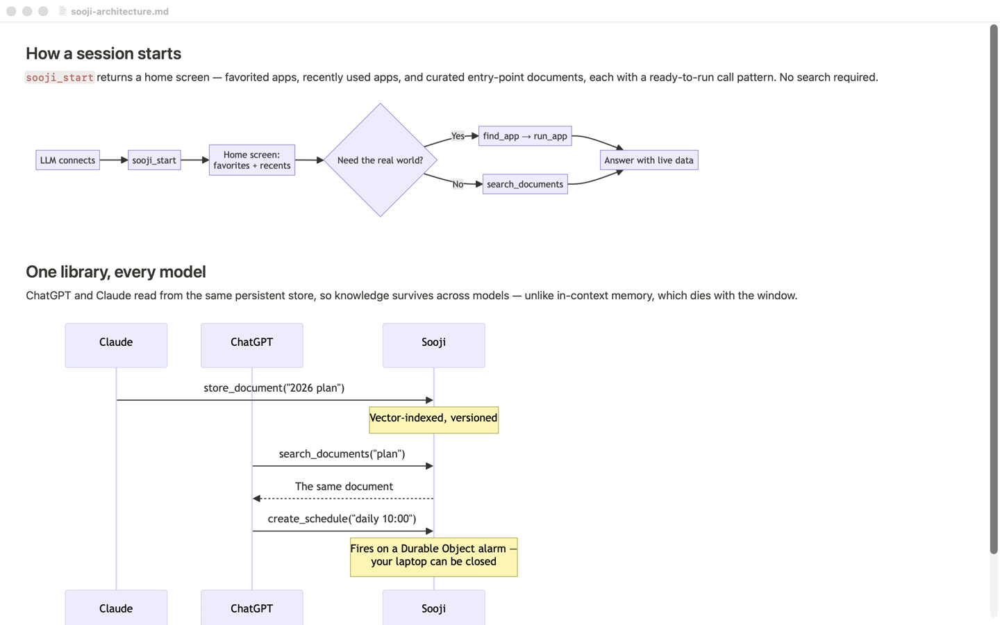
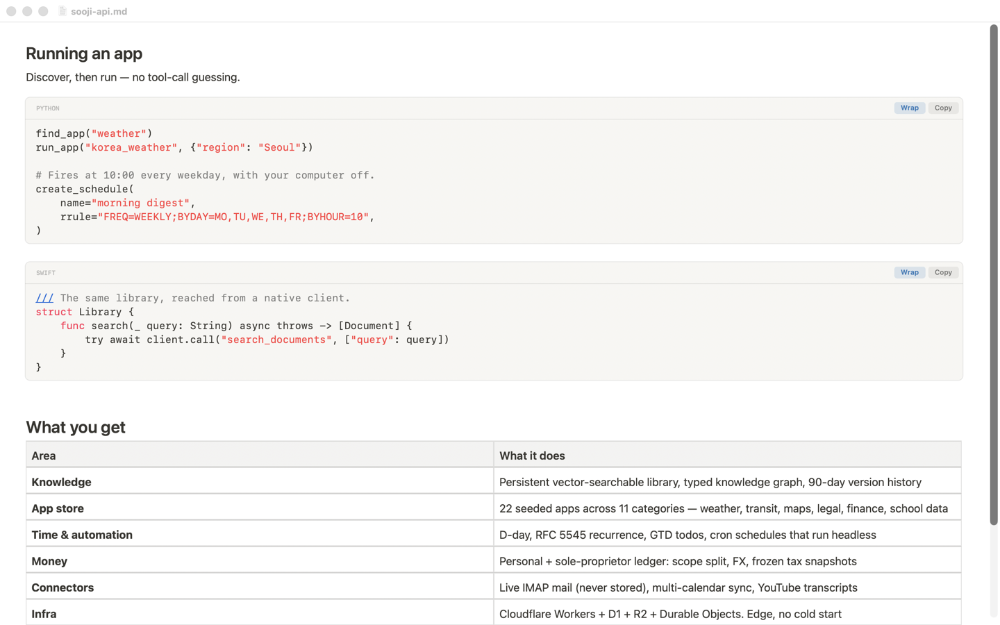

# Fast Markdown Reader

**AI writes it. You're the one reading it.** Plans, specs, summaries, transcripts — it all lands as
Markdown now, and reading it has quietly become most of the job. Your reader shouldn't be the slow
part of that.

Most Markdown apps are a web browser wearing a costume, which is why they take a beat to open and
why memory climbs the longer you leave them running. This one is pure Swift/AppKit/TextKit:
**0% idle CPU**, **~127 MB held flat across 9 large documents opened back to back**, and **~52 MB
reclaimed** when they close. No timers, no polling, no background web process.

It is the only native Mac Markdown viewer that renders **mermaid diagrams with the engine bundled
in the app** — offline, cached once as a vector PDF, and never re-rendered
([`MermaidCache.swift`](Sources/FastMDReader/Cache/MermaidCache.swift)). Images and diagrams
outside the viewport **release their pixels but keep their exact height**, so memory stays flat and
the scrollbar never jumps
([`SizedAttachmentCell.swift`](Sources/FastMDReader/Render/SizedAttachmentCell.swift)).

A reader, on purpose — it opens, renders, and gets out of the way. When something in the text is
wrong, right-click that block and **Edit** rewrites just its Markdown source back to the file. Fix
the typo, keep reading; no editor, no mode switch.

| | Fast Markdown Reader |
|---|---|
| Engine | 100% native AppKit + TextKit — **no web runtime for text** |
| Idle CPU | **0%** — no timers, no polling, no background web process |
| Memory | **flat under use** — ~127 MB across 9 large docs, ~52 MB reclaimed on close |
| Long docs | Non-contiguous layout renders only the viewport — a **4,000-paragraph** file opens instantly |
| Diagrams | **mermaid bundled** — renders offline, cached as vector PDF, never re-rendered |
| Images | Off-screen pixels freed, exact height kept — **no reflow, no scrollbar jitter** |
| Code | Native syntax highlighting, per-block **Copy** and **Wrap** |
| Editing | Reader first — but right-click any block → **Edit** fixes its Markdown source in place |

## Diagrams render offline, once

The mermaid engine ships inside the app — no CDN, no network, nothing to load. A diagram is
rendered a single time to a **vector PDF**, cached by content hash, and reused forever. Open the
same document again and diagrams appear instantly with zero web or JS cost. A document with no
diagrams never creates a web view at all.



## Images stay sharp without staying in memory

Every image and diagram **owns its layout size independently of its pixels**. Scroll away and the
pixels are released; scroll back and they return — but the reserved height never changes, so the
document length is stable and the scrollbar never swings. Sizes are measured up front (image
headers, cached PDFs, and remote images via a range request), so the page is laid out **once**.


## Code blocks are real cards



Fenced blocks render as rounded cards with a language label, native highlighting (swift, js/ts,
python, bash, json), a **Copy** button, and a **Wrap** toggle — no JavaScript involved. Tables,
task lists, footnotes and strikethrough come from CommonMark + GFM.

## Install

**Apple Silicon (arm64) only.** Requires macOS 13+.

Download the notarized zip, unzip it, drag `FastMDReader.app` to `/Applications`, double-click.
No Gatekeeper prompt and no `xattr` step — the app is signed with a Developer ID and stapled.

To make it your default Markdown viewer: right-click any `.md` in Finder → **Get Info** →
**Open with** → Fast Markdown Reader → **Change All…**.

## Build from source

```bash
./Scripts/make-app.sh        # builds FastMDReader.app (ad-hoc signed, unsandboxed)
open FastMDReader.app
```

Tests: `swift test`.

> **Toolchain note:** a standalone Command Line Tools install can ship a mismatched SwiftPM
> ManifestAPI that breaks `swift build`. `make-app.sh` prefers Xcode's toolchain automatically via
> `DEVELOPER_DIR`; make it permanent with `sudo xcode-select -s /Applications/Xcode.app`.

Signing identity and App Store Connect key ids are **not** in this repo — the release scripts read
them from `$KEYCHAIN_DIR/signing.env` (default `~/Documents/DEV/ww-w-ai/.keychains/`) and name the
missing variable if it isn't there. To sign as yourself, export your own; no code changes:

```bash
export IDENTITY="Developer ID Application: <You> (<TEAMID>)"
export NOTARY_PROFILE="<your notarytool keychain profile>"
./Scripts/notarize.sh        # signed + notarized + stapled zip
```

### Two builds, one difference

The direct download is **not sandboxed**; the Mac App Store build is (the store requires it).
Sandboxed, macOS grants an app only the file you opened — a document's own ``
sibling is a different file and is denied, with no prompt, because the sandbox refuses before macOS
asks and no "Documents folder" entitlement exists. So the store build asks once, per folder, and
remembers it; the direct build simply reads them. `SANDBOX=1 ./Scripts/make-app.sh` builds the
sandboxed shape locally.

## Keyboard (reading cursor)

Navigation **selects the unit it moves to**, so ⌘C copies it immediately. No Shift is used (Shift
stays free for system selection), and the keys avoid conflicts with standard macOS shortcuts.

| Key | Action (and what gets selected) |
|---|---|
| **⌥← / ⌥→** | Previous / next **sentence** (selects it) |
| **⌥↑ / ⌥↓** | Previous / next **paragraph** (selects it) |
| **⌘← / ⌘→** | Start / end of the current **line** (selects the line) |
| **[ / ]** | Previous / next **heading** (selects the whole subsection) |
| **click** (no drag) | Selects the **sentence** under the cursor |
| **number then Enter** | Jump to the Nth heading |
| **Space / ⇧Space** | Page down / up |
| **⌘↑ / ⌘↓** | Document start / end |
| **⌘F** | Find in document |
| **⌘+ / ⌘−** | Font size (persists to the next launch) |
| **↑ / ↓** | Scroll one line |

Page / number-jump / document-ends move without selecting. Mouse drag-selection and copy work as
usual. Click any diagram or image to open it in a zoomable window (pinch, `+`/`−`, `0` to fit).

**Fix a typo without leaving:** right-click a block → **Edit** opens just that block's Markdown
source; **⌘↵** writes it back to the file, **esc** discards. That is the only action that ever
writes to your document.

## License

MIT — see [LICENSE](LICENSE). Third-party attributions: [THIRD-PARTY-NOTICES.md](THIRD-PARTY-NOTICES.md).

Built by [DubDubDub Corp.](https://ww-w.ai)
