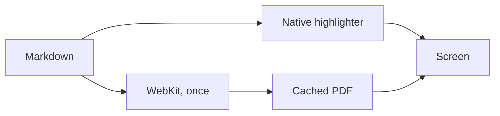

# Every language the reader highlights

34 languages, highlighted natively — no browser, no JavaScript, no theme download. Aliases work the
way people actually type them (`yml`, `golang`, `c++`, `c#`, `sh`, `postgres`, `tsx`, `patch`…).

A note on what you're looking at: every fence below contains a **URL inside a string** or a **`#`/`--`
inside a string**. Those are the cases a naive highlighter gets wrong — it sees `//` and greys out the
rest of the line. Nothing below should be grey except real comments.

---

## Systems

### C
```c
#include <stdio.h>

int main(void) {
    /* block comments too */
    const char *home = "https://ww-w.ai";   // not a comment inside the string
    printf("%s %d\n", home, 42);
    return 0;
}
```

### C++
```cpp
#include <vector>

namespace reader {
class Document {
public:
    explicit Document(std::string path) : path_(std::move(path)) {}
    bool open() const { return !path_.empty(); }   // 3.14 numbers, "strings"
private:
    std::string path_;
};
}
```

### Rust
```rust
use std::collections::HashMap;

#[derive(Debug)]
struct Reader { home: String, opened: u64 }

impl Reader {
    fn new() -> Self {
        Self { home: "https://ww-w.ai".to_string(), opened: 0 }  /* still a string */
    }
    fn open(&mut self) -> Result<(), std::io::Error> {
        self.opened += 1;
        Ok(())
    }
}
```

### Go
```go
package main

import "fmt"

type Reader struct {
	Home   string
	Opened int
}

func main() {
	r := Reader{Home: "https://ww-w.ai", Opened: 0} // the // above is inside a string
	for i := 0; i < 10; i++ {
		r.Opened++
	}
	fmt.Println(r.Home, r.Opened)
}
```

### Objective-C
```objc
#import <Foundation/Foundation.h>

@interface Reader : NSObject
@property (nonatomic, strong) NSString *home;
@end

@implementation Reader
- (BOOL)open {
    self.home = @"https://ww-w.ai";   // comment
    return YES;
}
@end
```

---

## Apple

### Swift
```swift
import Foundation

struct Reader {
    let home = URL(string: "https://ww-w.ai")!   // types are teal, keywords pink
    var opened = 0

    mutating func open() throws -> Bool {
        opened += 1
        guard opened < 100 else { return false }
        return true
    }
}
```

---

## JVM & friends

### Java
```java
package ai.wwW.reader;

import java.util.List;

public class Reader {
    private static final String HOME = "https://ww-w.ai";  // still a string

    public boolean open(List<String> paths) {
        for (String p : paths) {
            if (p.isEmpty()) return false;
        }
        return true;
    }
}
```

### Kotlin
```kotlin
package ai.wwW.reader

data class Reader(val home: String = "https://ww-w.ai", var opened: Int = 0) {
    fun open(): Boolean {
        opened++
        return when {
            opened > 100 -> false   // comment
            else -> true
        }
    }
}
```

### Scala
```scala
package ai.wwW.reader

case class Reader(home: String = "https://ww-w.ai", opened: Int = 0) {
  def open: Either[String, Reader] = // comment
    if (opened > 100) Left("too many") else Right(copy(opened = opened + 1))
}
```

### Dart
```dart
class Reader {
  final String home;
  int opened;

  Reader({this.home = 'https://ww-w.ai', this.opened = 0});

  Future<bool> open() async {   // comment
    opened += 1;
    return opened < 100;
  }
}
```

---

## Web

### JavaScript
```javascript
const HOME = "https://ww-w.ai";   // the // in the URL stays a string

export async function open(paths) {
  const results = [];
  for (const p of paths) {
    if (!p) continue;
    results.push(await fetch(`${HOME}/${p}`));   // template literals too
  }
  return results;
}
```

### TypeScript
```typescript
interface Reader {
  home: string;
  opened: number;
}

type Result<T> = { ok: true; value: T } | { ok: false; error: string };

export const open = async (r: Reader): Promise<Result<number>> => {
  if (r.opened > 100) return { ok: false, error: "too many" };
  return { ok: true, value: r.opened + 1 };   // comment
};
```

### HTML
```html
<!doctype html>
<html lang="en">
  <head>
    <meta charset="utf-8">
    <title>Fast Markdown Reader</title>
  </head>
  <body>
    <!-- a real comment -->
    <a href="https://ww-w.ai/fast-markdown-reader">Download</a>
  </body>
</html>
```

### CSS
```css
:root {
  --ink: #33271f;
  --paper: #fffdf8;
}

.reader {
  color: var(--ink);
  background: var(--paper);
  font-size: 16px;   /* only block comments here */
}
```

### XML
```xml
<?xml version="1.0" encoding="UTF-8"?>
<plist version="1.0">
  <!-- CFBundleIdentifier is what NSDocumentController resolves -->
  <dict>
    <key>CFBundleName</key>
    <string>Fast Markdown Reader</string>
  </dict>
</plist>
```

### PHP
```php
<?php
namespace Reader;

class Document {
    private $home = "https://ww-w.ai";   // and # is a comment here too

    public function open(string $path): bool {
        if (empty($path)) return false;
        return true;
    }
}
```

---

## Scripting

### Python
```python
from dataclasses import dataclass

HOME = "https://ww-w.ai"   # a hash inside a string is safe: "tag: #1"

@dataclass
class Reader:
    home: str = HOME
    opened: int = 0

    def open(self, paths: list[str]) -> bool:
        """Docstrings are strings, all the way through."""
        for p in paths:
            if not p:
                return False
        return True
```

### Ruby
```ruby
class Reader
  HOME = "https://ww-w.ai".freeze

  def initialize(opened: 0)
    @opened = opened
  end

  def open(paths)
    paths.each { |p| return false if p.empty? }   # comment
    true
  end
end
```

### Perl
```perl
package Reader;
use strict;

my $home = "https://ww-w.ai";   # comment

sub open_all {
    my ($self, @paths) = @_;
    foreach my $p (@paths) {
        return 0 unless length $p;
    }
    return 1;
}
```

### Lua
```lua
local Reader = {}
Reader.home = "https://ww-w.ai"   -- dashes start comments here

function Reader.open(paths)
  for _, p in ipairs(paths) do
    if p == "" then return false end
  end
  return true
end
```

### R
```r
library(dplyr)

home <- "https://ww-w.ai"   # comment

open_all <- function(paths) {
  for (p in paths) {
    if (nchar(p) == 0) return(FALSE)
  }
  TRUE
}
```

### Elixir
```elixir
defmodule Reader do
  @home "https://ww-w.ai"

  def open(paths) when is_list(paths) do   # comment
    Enum.all?(paths, fn p -> String.length(p) > 0 end)
  end
end
```

### Haskell
```haskell
module Reader where

import Data.List (all)

home :: String
home = "https://ww-w.ai"   -- comment

open :: [String] -> Bool
open paths = all (not . null) paths
```

---

## Shell & ops

### Bash
```bash
#!/usr/bin/env bash
set -euo pipefail

HOME_URL="https://ww-w.ai"
echo "release tag: #1 — a hash inside a string is not a comment"   # this one is

for f in *.md; do
  [ -s "$f" ] || continue
  echo "$f" && wc -l "$f"
done
```

### PowerShell
```powershell
param([string]$Home = "https://ww-w.ai")

function Open-Documents {   # comment
    <# a block comment #>
    foreach ($p in $args) {
        if (-not $p) { return $false }
    }
    return $true
}
```

### Dockerfile
```dockerfile
FROM swift:6.0 AS build
WORKDIR /src
COPY . .
RUN swift build -c release   # comment

FROM debian:bookworm-slim
COPY --from=build /src/.build/release/FastDocReader /usr/local/bin/
ENTRYPOINT ["FastDocReader"]
```

### Makefile
```makefile
.PHONY: build test app

build:   # comment
	swift build -c release

test:
	swift test

app: build
	./Scripts/make-app.sh release
```

---

## Data & config

### JSON
```json
{
  "name": "fast-markdown-reader",
  "home": "https://ww-w.ai",
  "sandboxed": true,
  "languages": 34,
  "engines": ["mermaid", "katex"]
}
```

### YAML
```yaml
name: fast-markdown-reader
home: https://ww-w.ai      # comments after values
sandboxed: true
languages: 34
engines:
  - mermaid
  - katex
```

### TOML
```toml
[package]
name = "fast-markdown-reader"
home = "https://ww-w.ai"   # comment
languages = 34

[engines]
mermaid = true
katex = true
```

### INI
```ini
; semicolons and hashes both start comments
[reader]
home = https://ww-w.ai
sandboxed = true
languages = 34
```

### SQL
```sql
-- dashes start a comment here, not a minus
select
    name,
    count(*) as opens
from documents
where opened_at > '2026-07-01'   /* block comments too */
group by name
having count(*) > 3
order by opens desc
limit 10;
```

---

## Change sets

### Diff
```diff
@@ -1,5 +1,5 @@
 # Fast Markdown Reader
-No Electron, no web view, no spinner.
-Built with pure Swift/AppKit and non-contiguous layout.
+It's a text file. Why is your fan on?
+Opens the instant you click it, and stays out of your way.
 
 ## Install
```

### C#
```csharp
using System.Collections.Generic;

namespace Reader {
    public class Document {
        private const string Home = "https://ww-w.ai";   // string, not comment

        public bool Open(IEnumerable<string> paths) {
            foreach (var p in paths) {
                if (string.IsNullOrEmpty(p)) return false;
            }
            return true;
        }
    }
}
```

---

## And everything else still works

Diagrams render offline, from the app itself:



Formulas too:

$$
\text{time to first paint} = \sum_{i=1}^{n} \frac{\text{cached}_i}{\text{engine}}
$$

An unknown language just falls back to plain monospace — no crash, no guessing:

```prolog
ancestor(X, Y) :- parent(X, Y).
ancestor(X, Y) :- parent(X, Z), ancestor(Z, Y).
```
