# Twelve photographs, and your place on the page never moves

This is the document that breaks lazy readers. Real photographs, every one a different height —
wide horizons, tall portraits, a whole gallery in one file.

Scroll down and back up, fast. Watch two things:

- **The scroll bar doesn't twitch.** Its size is right from the moment the document opens, because
  every photo was measured before a single line was laid out. Readers that measure images as they
  arrive make the page grow underneath you, and the line you were reading slides away.
- **Memory stays flat.** Photos far behind you quietly hand their memory back and reload when you
  return. Their *space* is never given up — that's the difference, and it's why nothing shifts.

Then jump to the end with ⌘↓ and come back. Same story.

Everything below is public domain or CC0, mostly from NOAA. Provenance and licences:
[`assets/CREDITS.md`](assets/CREDITS.md). They're whales and ships because the reader next door is
holding [*Moby-Dick*](moby-dick.md).

---

## Two blue whales, from the air

The largest animals that have ever lived, photographed from above by a marine sanctuary survey.

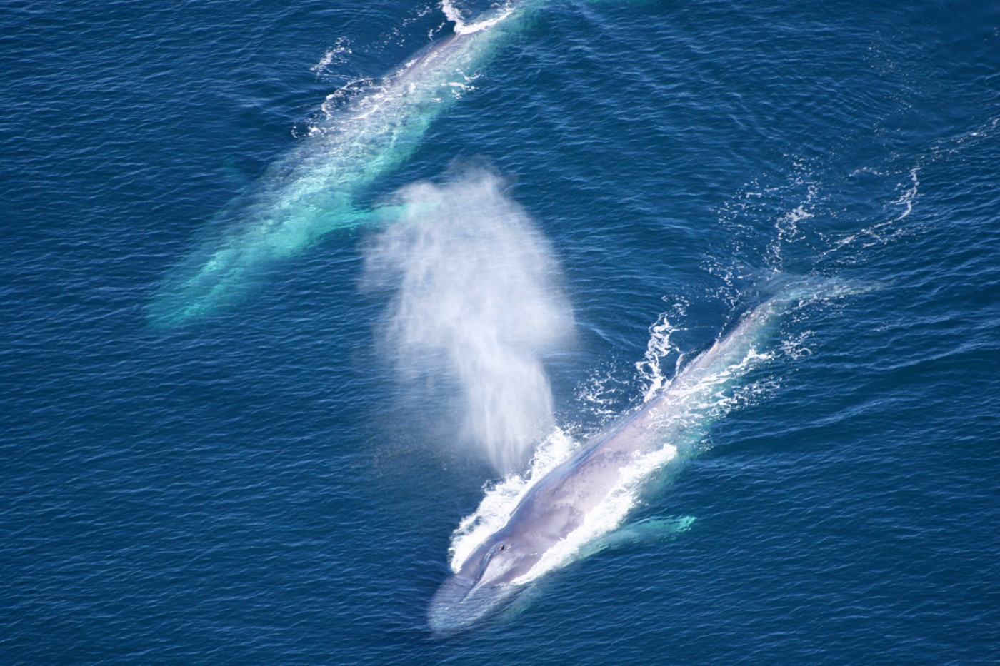

## An orca off the bow

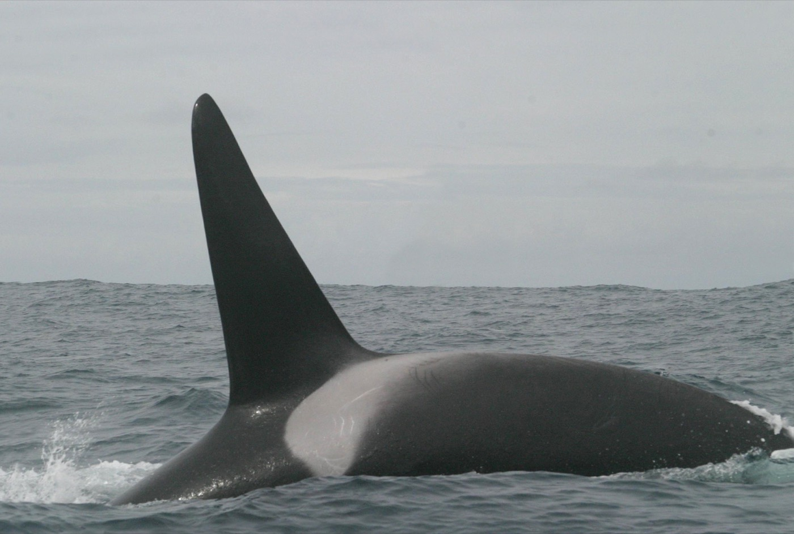

## A humpback breaching

Forty tons leaving the water. Zoom in — the photo stays sharp, and it costs nothing while it's
off screen.

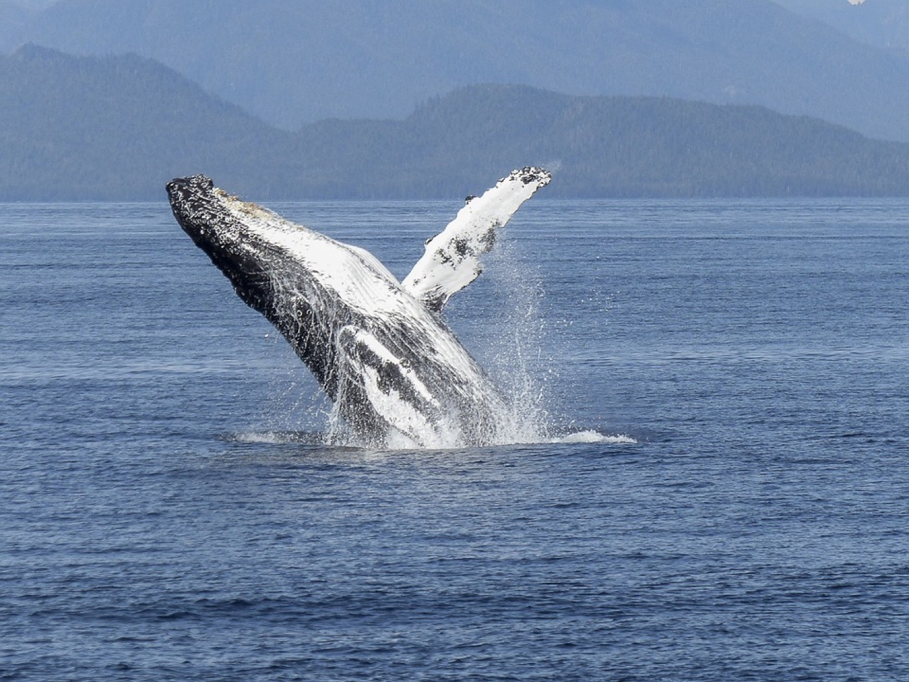

## A blue whale's fluke

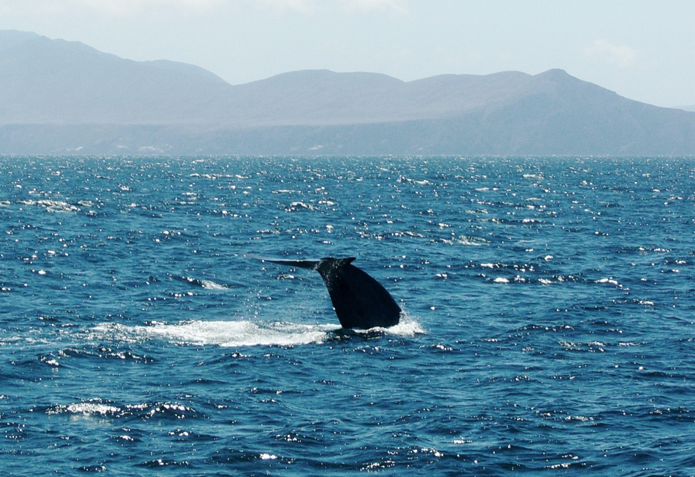

## The coastline at American Samoa

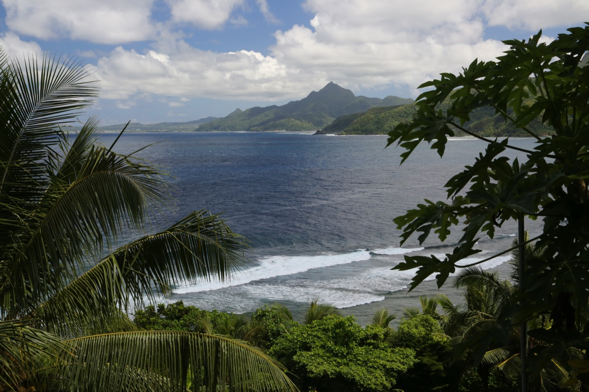

## A ship's bow

A tall photograph, in a document full of wide ones. The layout doesn't care.

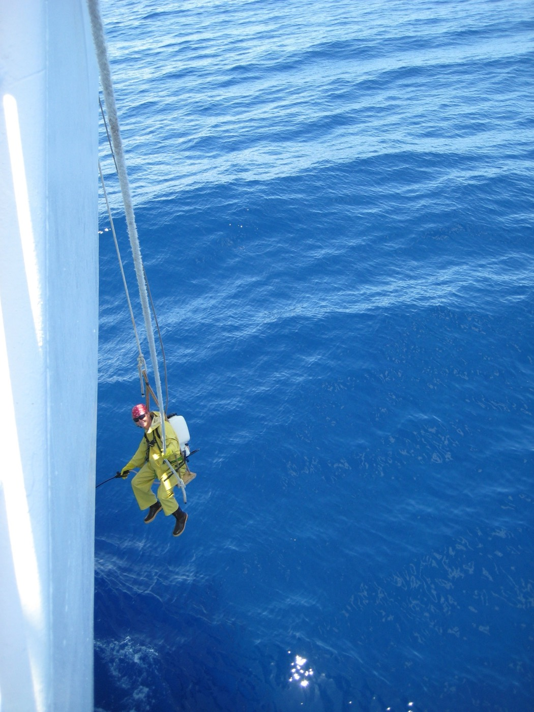

## Waves

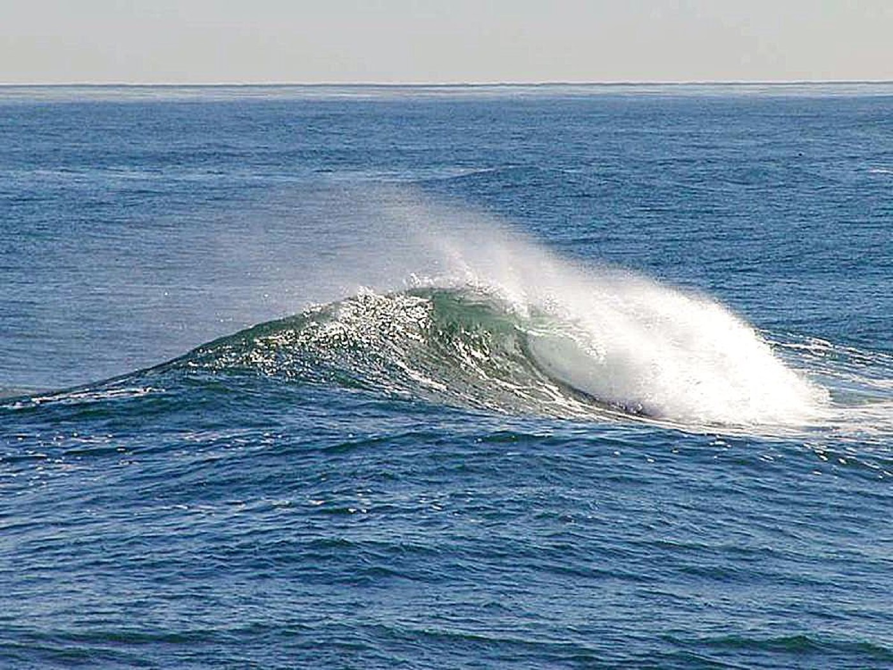

## Sunset over open ocean

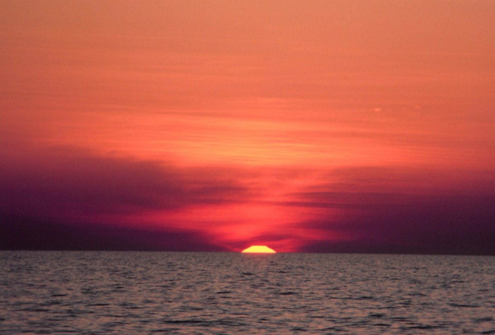

## The same sun, standing up

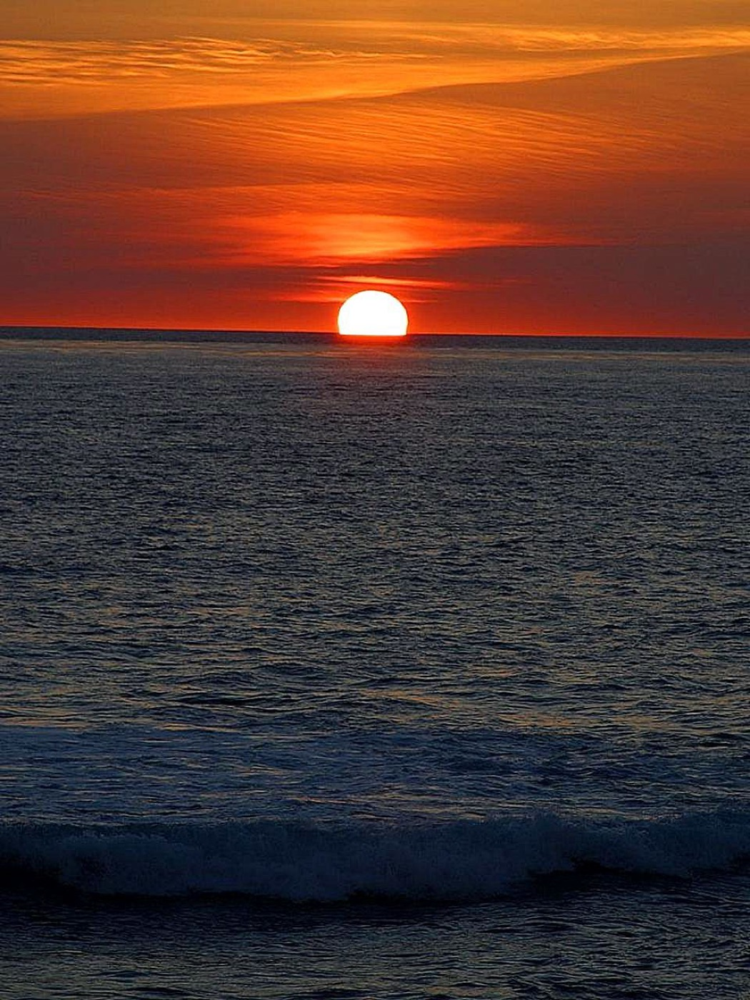

## A three-masted schooner, around 1900

The century Melville was read in, photographed at anchor.

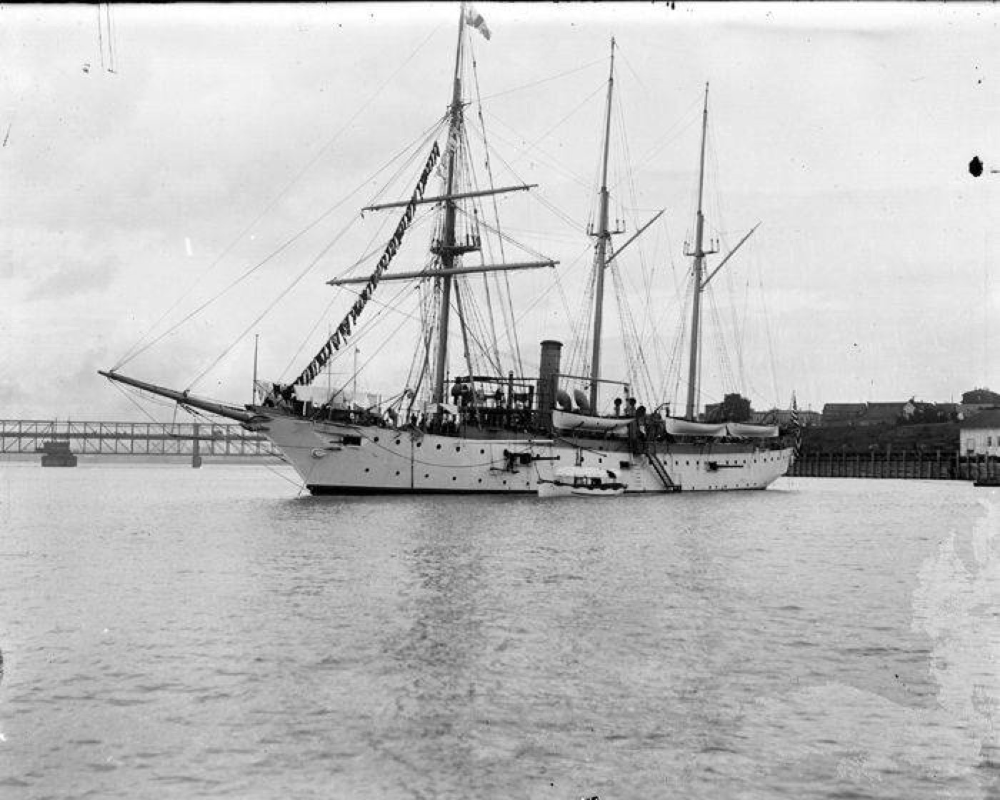

## The bark *Tidal Wave*, around 1900

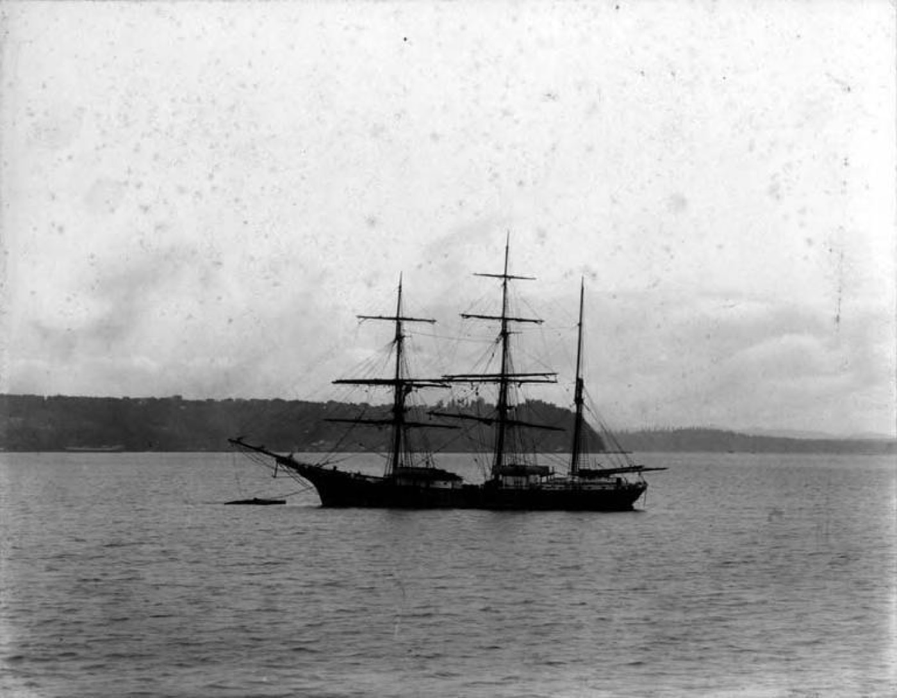

## A humpback, entangled

Not every photograph is a postcard. A NOAA team documented this whale during a disentanglement
response — the same camera, the same ocean, a different day.

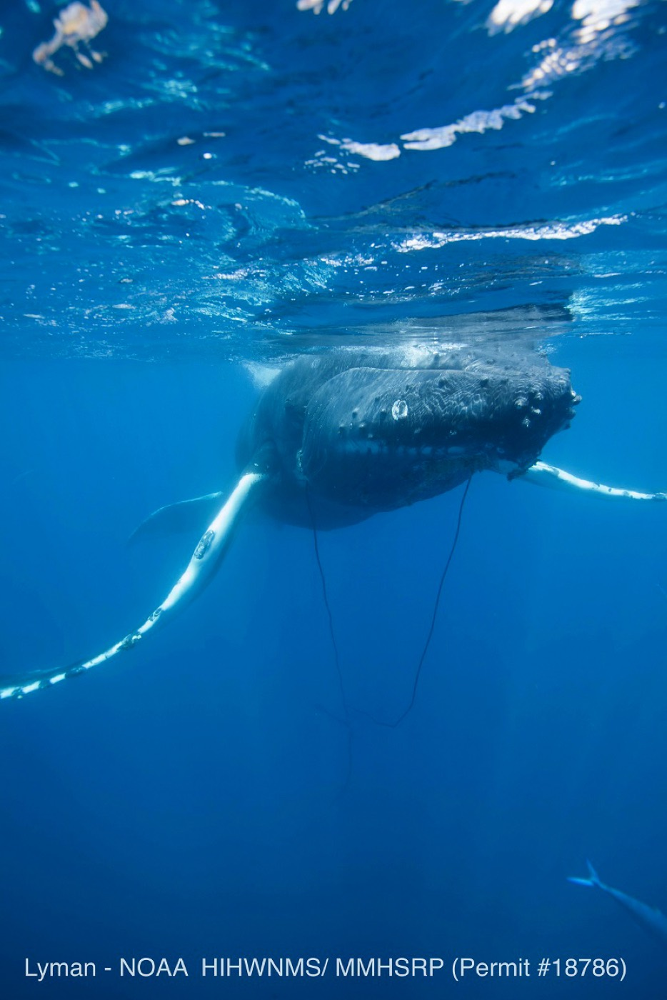

---

## Still here

If the scroll bar is the same size it was when you opened this, and your place never jumped, the
whole point of the app just happened — quietly, which is the idea.
