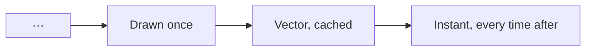

# Formulas, drawn once and cached forever

Every formula here is rendered **by the app itself** — no internet, on a plane, in a tunnel. Each one
is drawn a single time to vector art, cached, and after that it appears instantly and stays sharp
however far you zoom in.

Write it the way you already do, the way every AI writes it: between `$$`.

> The equations below are the common property of the field — you'll find them in any textbook. The
> words around them are ours.

---

## The one everybody knows

$$
E = mc^2
$$

Subscripts and superscripts survive intact — the thing Markdown normally eats alive:

$$
a_1^2 + a_2^2 = \sum_{i=1}^{n} x_i^{2}
$$

And the most beautiful identity in mathematics, which needs nothing else to be worth rendering:

$$
e^{i\pi} + 1 = 0
$$

---

## Attention, and the things around it

The line every model you use is built on — scaled dot-product attention:

$$
\mathrm{Attention}(Q, K, V) = \mathrm{softmax}\!\left(\frac{QK^\top}{\sqrt{d_k}}\right)V
$$

Several of those at once, which is what "multi-head" means:

$$
\mathrm{MultiHead}(Q,K,V) = \mathrm{Concat}(\mathrm{head}_1, \dots, \mathrm{head}_h)\,W^O
\quad\text{where}\quad
\mathrm{head}_i = \mathrm{Attention}(QW_i^Q,\, KW_i^K,\, VW_i^V)
$$

Softmax itself — turning any set of numbers into something that behaves like probability:

$$
\mathrm{softmax}(z)_i = \frac{e^{z_i}}{\sum_{j=1}^{K} e^{z_j}}
$$

How wrong the model was, which is the only thing training actually listens to:

$$
\mathcal{L}_{\mathrm{CE}} = -\sum_{i=1}^{C} y_i \log \hat{y}_i
$$

The perplexity people quote in every model card is just that, exponentiated:

$$
\mathrm{PPL} = \exp\!\left(-\frac{1}{N}\sum_{i=1}^{N} \log p(x_i \mid x_{<i})\right)
$$

Keeping layers stable enough to stack a hundred of them:

$$
\mathrm{LayerNorm}(x) = \gamma \odot \frac{x - \mu}{\sqrt{\sigma^2 + \epsilon}} + \beta
$$

---

## Learning

Gradient descent, in one line — everything else is a refinement of it:

$$
\theta_{t+1} = \theta_t - \eta \nabla_\theta \mathcal{L}(\theta_t)
$$

Adam, the refinement almost everyone actually runs:

$$
\begin{aligned}
m_t &= \beta_1 m_{t-1} + (1 - \beta_1) g_t \\
v_t &= \beta_2 v_{t-1} + (1 - \beta_2) g_t^2 \\
\hat{m}_t &= \frac{m_t}{1 - \beta_1^t}, \qquad \hat{v}_t = \frac{v_t}{1 - \beta_2^t} \\
\theta_t &= \theta_{t-1} - \eta \cdot \frac{\hat{m}_t}{\sqrt{\hat{v}_t} + \epsilon}
\end{aligned}
$$

The chain rule, which is all backpropagation is:

$$
\frac{\partial \mathcal{L}}{\partial w_{ij}}
= \frac{\partial \mathcal{L}}{\partial a_j} \cdot
  \frac{\partial a_j}{\partial z_j} \cdot
  \frac{\partial z_j}{\partial w_{ij}}
$$

A neuron, stripped of mystique:

$$
a = \sigma\!\left(\sum_{i=1}^{n} w_i x_i + b\right), \qquad
\sigma(z) = \frac{1}{1 + e^{-z}}
$$

Activations, defined by cases — the `cases` environment earns its keep here:

$$
\mathrm{ReLU}(x) = \max(0, x) = \begin{cases}
x & \text{if } x > 0 \\
0 & \text{otherwise}
\end{cases}
$$

The evidence lower bound, which is what a VAE is really optimising:

$$
\log p(x) \geq \mathbb{E}_{q(z \mid x)}\!\left[\log p(x \mid z)\right]
- D_{\mathrm{KL}}\!\left(q(z \mid x) \,\|\, p(z)\right)
$$

---

## Probability, which is most of it

Bayes' theorem — the whole of inference in one fraction:

$$
P(A \mid B) = \frac{P(B \mid A)\,P(A)}{P(B)}
$$

The normal distribution:

$$
f(x) = \frac{1}{\sigma\sqrt{2\pi}} \, e^{-\frac{1}{2}\left(\frac{x - \mu}{\sigma}\right)^2}
$$

Expectation and variance, side by side:

$$
\mathbb{E}[X] = \sum_{i} x_i\, p(x_i), \qquad
\mathrm{Var}(X) = \mathbb{E}\!\left[(X - \mathbb{E}[X])^2\right]
$$

Entropy — how surprised you should expect to be:

$$
H(X) = -\sum_{i=1}^{n} p(x_i) \log_2 p(x_i)
$$

And the distance between what you believe and what's true:

$$
D_{\mathrm{KL}}(P \,\|\, Q) = \sum_{x \in \mathcal{X}} P(x) \log \frac{P(x)}{Q(x)}
$$

---

## Linear algebra, laid out properly

Matrix multiplication, written out so you can see the shape of it:

$$
\begin{pmatrix} a & b \\ c & d \end{pmatrix}
\begin{pmatrix} x \\ y \end{pmatrix}
=
\begin{pmatrix} ax + by \\ cx + dy \end{pmatrix}
$$

Eigenvectors — the directions a transformation leaves alone:

$$
A\mathbf{v} = \lambda\mathbf{v}
$$

A determinant, in the bars that mean determinant:

$$
\det(A) = \begin{vmatrix} a & b \\ c & d \end{vmatrix} = ad - bc
$$

Cosine similarity, which is how your vector database decides what you meant:

$$
\cos(\theta) = \frac{\mathbf{a} \cdot \mathbf{b}}{\|\mathbf{a}\|\,\|\mathbf{b}\|}
= \frac{\sum_{i=1}^{n} a_i b_i}{\sqrt{\sum_{i=1}^{n} a_i^2}\,\sqrt{\sum_{i=1}^{n} b_i^2}}
$$

---

## Calculus and the classics

Two integrals, one famous and one useful:

$$
\int_{-\infty}^{\infty} e^{-x^2}\,dx = \sqrt{\pi}
$$

$$
\int_a^b f(x)\,dx = F(b) - F(a)
$$

A limit, a derivative, and a series, in the notation they're taught in:

$$
\frac{d}{dx}f(x) = \lim_{h \to 0} \frac{f(x + h) - f(x)}{h}
$$

$$
e^x = \sum_{n=0}^{\infty} \frac{x^n}{n!} = 1 + x + \frac{x^2}{2!} + \frac{x^3}{3!} + \cdots
$$

The equation an entire field is named after:

$$
i\hbar\frac{\partial}{\partial t}\Psi(\mathbf{r}, t)
= \hat{H}\Psi(\mathbf{r}, t)
$$

Nested roots and fractions, because that's where a renderer usually gives up:

$$
\phi = \frac{1 + \sqrt{5}}{2} = 1 + \cfrac{1}{1 + \cfrac{1}{1 + \cfrac{1}{1 + \cdots}}}
$$

---

## The fences, and the fine print

GitHub's fenced form works too, if that's what your tools emit:

```math
\mathrm{IoU} = \frac{|A \cap B|}{|A \cup B|}
```

Money is safe: a line about $5 coffee and a $10 lunch stays a line about coffee and lunch.

Formulas sit happily beside everything else:


